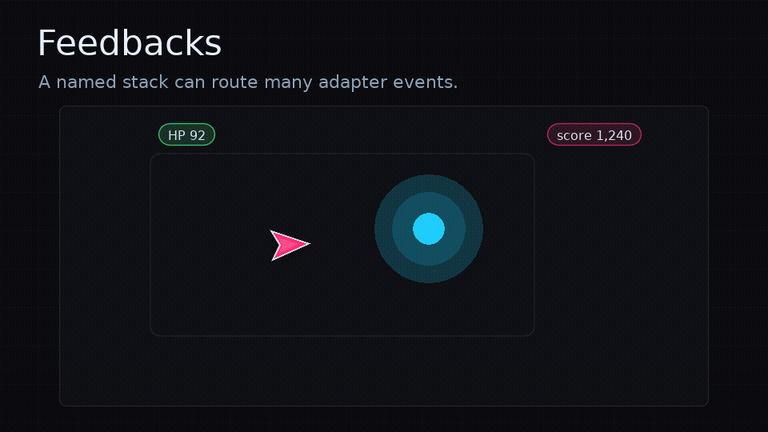

# Feedback Authoring

<!-- feel:feature-gif feedbacks -->

<!-- /feel:feature-gif feedbacks -->

`feel.feedbacks` is an optional authoring layer for named feedback stacks. It sits on top of `feel.play`, `feel.channel`, `feel.love`, `feel.g3d`, and `feel.menori`; it does not replace them.

Use it when gameplay should announce a feedback by name while one module owns the camera, post-processing, particles, audio, time, and model juice.

```lua
local feel = require("feel")
local feelLove = require("feel.love")
local feelG3d = require("feel.g3d")
local g3d = require("g3d")

local fx = feelLove.new()
local g3dfx = feelG3d.new(g3d)
local Feedbacks = require("feel.feedbacks").new({
  love = fx,
  g3d = g3dfx,
})

Feedbacks.define("hit.heavy", {
  { kind = "time.freeze", duration = 0.04 },
  {
    kind = "parallel",
    steps = {
      { kind = "screen.flash", color = { 1, 0.8, 0.25, 1 }, amount = 0.3, duration = 0.08 },
      { kind = "g3d.camera.shake", amount = 0.14, duration = 0.16 },
      { kind = "g3d.camera.fov", amount = 5, duration = 0.05, returnDuration = 0.18 },
      { kind = "g3d.model.scalePunch", name = "enemy", amount = 0.22, duration = 0.06 },
      { kind = "sound.play", cue = "heavy_hit", pitch = { 0.92, 1.08 } },
    },
  },
})

Feedbacks.play("hit.heavy", { x = enemy.x, y = enemy.y, z = enemy.z })

function love.update(dt)
  local gameDt = dt * Feedbacks.timeScale()
  updateGameplay(gameDt)

  feel.update(dt)
  g3dfx:update()
  fx:update(dt)
end
```

## API

| Function | Purpose |
| --- | --- |
| `Feedbacks.define(name, steps)` | Store a named feedback manifest. |
| `Feedbacks.get(name)` | Return a manifest. |
| `Feedbacks.play(nameOrSteps, context, opts)` | Compile and play a named or inline manifest. |
| `Feedbacks.clear(name)` | Clear one manifest, or all manifests when omitted. |
| `Feedbacks.timeScale()` | Return the explicit feedback time scale. |
| `Feedbacks.timeTarget()` | Return the internal time target. |

`opts` accepts normal `feel.play` options such as `restart`, `key`, `trigger`, `emit`, `audio`, `log`, and `markDirty`. It also accepts `target` for manifests that include normal `animate` steps.

## Shorthand Steps

Core sequence steps still work unchanged. Adapter-style steps are shorthand for `emit` steps:

```lua
{ kind = "screen.flash", amount = 0.2, duration = 0.06 }
{ kind = "post.tween", effect = "bloom", values = { intensity = 1.2 }, duration = 0.1 }
{ kind = "particle.emit", name = "sparks", x = "$x", y = "$y", count = 18 }
{ kind = "g3d.camera.height", amount = 0.2, duration = 0.06, returnDuration = 0.2 }
{ kind = "menori.node.scalePunch", name = "enemy", amount = 0.18, duration = 0.06 }
```

Events are routed to the configured LOVE adapter, then the g3d adapter, then the Menori adapter, then your optional `emit` callback.

## Context Values

`Feedbacks.play(name, context)` resolves small runtime values while compiling:

```lua
Feedbacks.define("spark.at", {
  {
    kind = "particle.emit",
    name = "sparks",
    x = "$x",
    y = function(ctx) return ctx.y - 8 end,
    speed = { 120, 180 },
    color = { 1, 0.75, 0.2, 1 },
  },
})
```

- `"$x"` reads `context.x`; dotted paths like `"$enemy.x"` work too.
- Functions receive the context table.
- Numeric two-item ranges are randomized for scalar fields such as `pitch`, `volume`, `amount`, `duration`, `scale`, and `speed`.
- Color arrays are copied as arrays, not treated as random ranges.

## Time

Time feedback is explicit. `time.freeze`, `time.slow`, and `time.restore` animate an internal target, and the game decides which systems use it:

```lua
Feedbacks.define("parry", {
  { kind = "time.slow", scale = 0.25, duration = 0.12, returnDuration = 0.08 },
})

function love.update(dt)
  local gameDt = dt * Feedbacks.timeScale()
  updateWorld(gameDt)
  feel.update(dt)
end
```

Keep `feel.update(dt)` on real dt so hitstop can recover.

## Boundaries

`feel.feedbacks` is for feedback composition. Keep gameplay state, entity messaging, assets, collisions, rendering, and scene management in your app. For lower-level intent routing, use [`feel.channel`](api.md#feelchannel).
