# feel.lua Docs

## What Is feel.lua?

`feel.lua` is a small feedback sequencing library for Löve. It lets you describe moment-to-moment game feel as reusable Lua recipes: tween these values, wait, play these steps in parallel, emit this particle/sound/shake event, then settle back.

The core does not own your rendering, audio, particles, shaders, models, or game objects. You keep those in your app. `feel.lua` owns the timing and target values, then hands side effects back to you through callbacks or optional adapters.

Use it when an action should read better: a button press, player hit, reward reveal, camera punch, UI pulse, shader sweep, sound cue, haptic tick, or a named feedback stack that combines several of those at once.

## Structure

`feel.lua` is split into a tiny core recipe runner and opt-in LOVE helpers. These docs group related features together so you can read the layer you are working in.

## What To Read First

1. [Installation](installation.md): add the core module and, optionally, the LOVE adapter.
2. [Getting Started](getting-started.md): build a minimal LOVE loop with one animated target and one sequence.
3. [Sequence Steps](sequence-steps.md): learn the table shapes that make up a recipe.
4. [LOVE Adapter](love-adapter.md): connect recipe events to sounds, haptics, particles, shaders, camera, screen, and post effects.
5. [LOVE Examples](love-examples.md): run the showcase or the Asteroidz example.

## Guides

| Page                                  | Use it for                                                                                                                        |
| ------------------------------------- | --------------------------------------------------------------------------------------------------------------------------------- |
| [Core Runner](core-runner.md)         | Targets, named sequences, playback, updates, clearing, and callback context.                                                      |
| [Sequence Steps](sequence-steps.md)   | `animate`, `emit`, `audio`, `wait`, `play`, `parallel`, `repeat`, `random`, `callback`, and `log`.                                |
| [API](api.md)                         | Compact function signatures, options, and exported helpers.                                                                       |
| [Autocomplete](autocomplete.md)       | LuaLS setup, local definition files, LOVE2D types, and custom target values.                                                      |
| [LOVE Adapter](love-adapter.md)       | Registered sound cues, haptics, particle systems, shaders, post-processing, camera events, screen overlays, and adapter handlers. |
| [Post Processing](post-processing.md) | Built-in LOVE canvas effects, parameters, and recipes.                                                                            |
| [g3d Helpers](g3d.md)                 | Optional helpers for binding `feel.target` values to groverburger/g3d models and cameras.                                         |
| [Menori Helpers](menori.md)           | Optional helpers for binding `feel.target` values to Menori nodes, cameras, animations, and uniforms.                             |
| [LOVE Examples](love-examples.md)     | Showcase scenes and feature-specific examples.                                                                                    |
| [Asteroidz Walkthrough](asteroidz.md) | A small game showing sequences, post-processing, UI juice, and adapter events together.                                           |

<!-- feel:feature-gif-gallery -->

## Feature GIFs

| Feature         | Preview                                                                                                                                 |
| --------------- | --------------------------------------------------------------------------------------------------------------------------------------- |
| Getting Started | 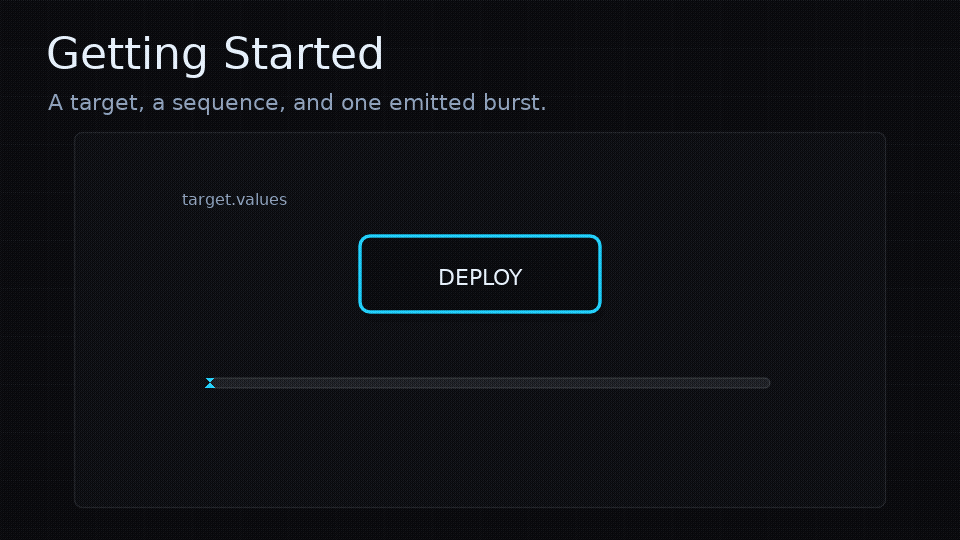                 |
| Animate         | 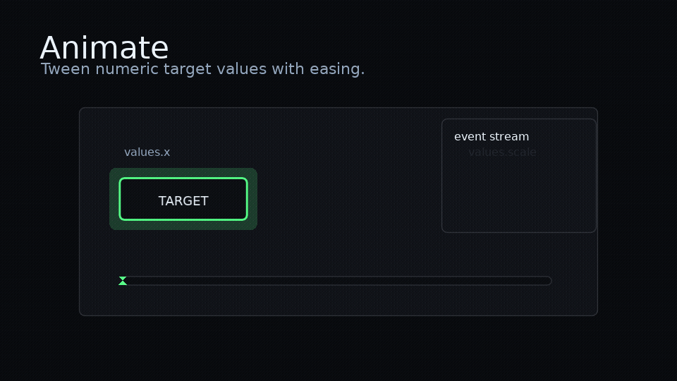                              |
| Easing          | 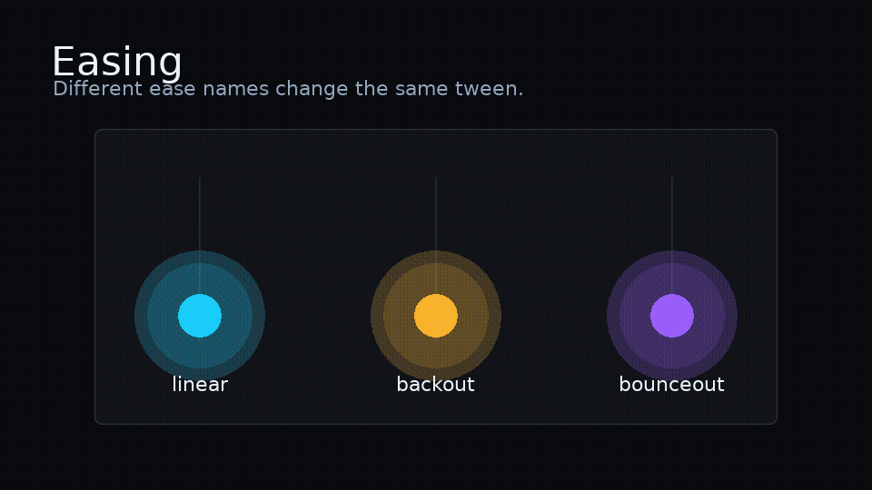 |
| Sequence        |                                      |
| Parallel        | 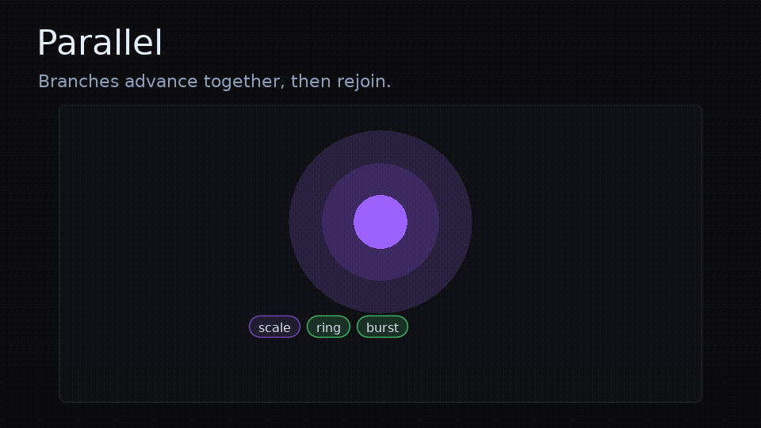                                |
| Repeat          | 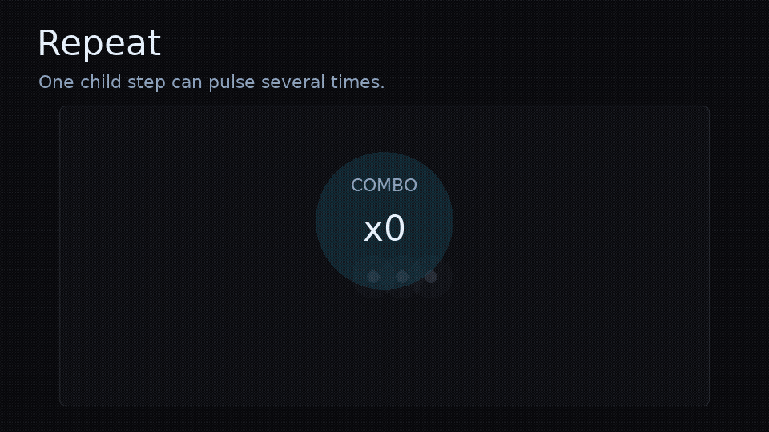                                   |
| Random          | 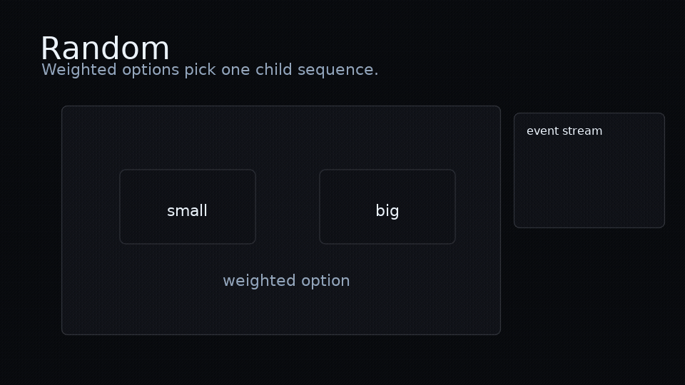                     |
| Callbacks       | 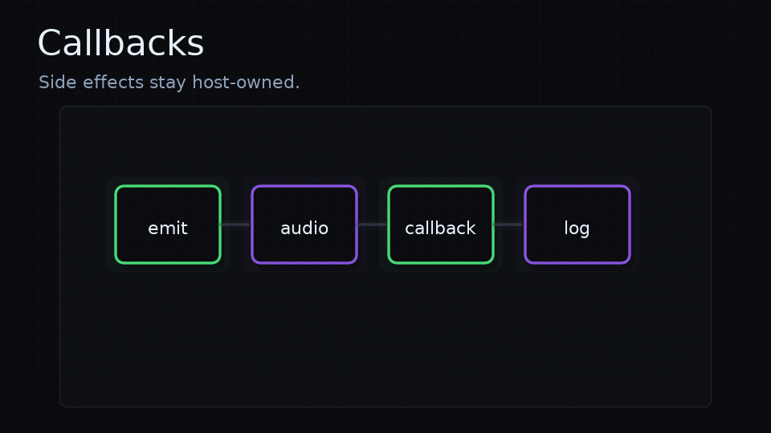            |
| Pulse           | 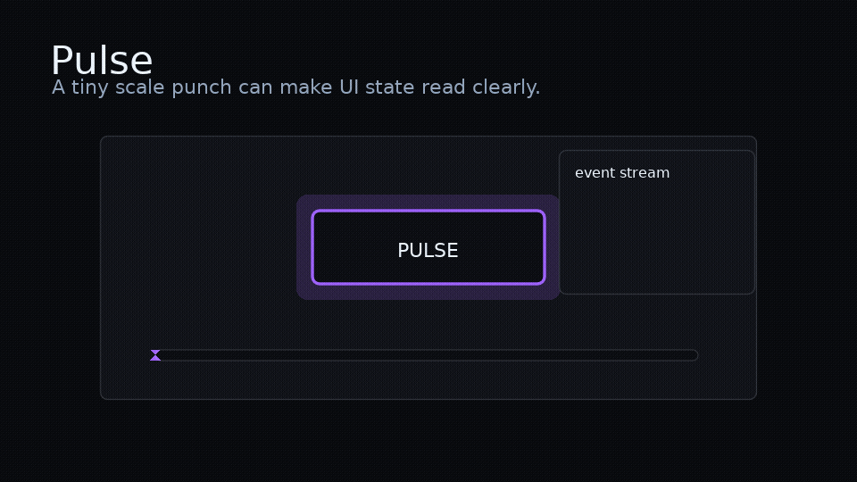                                     |
| Shake           |                              |
| Flash           | 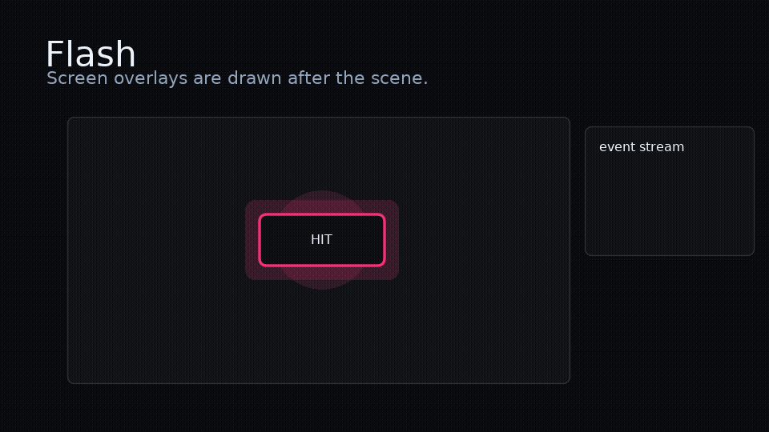                                          |
| Sound           | 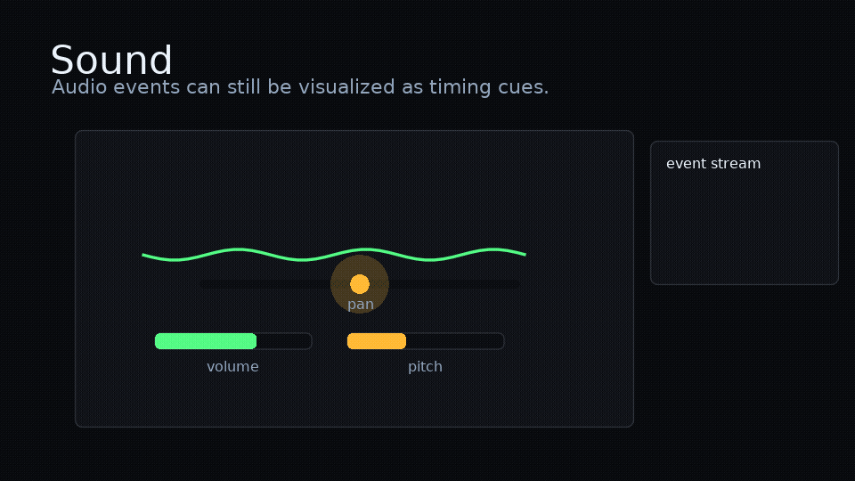                                    |
| Haptics         | 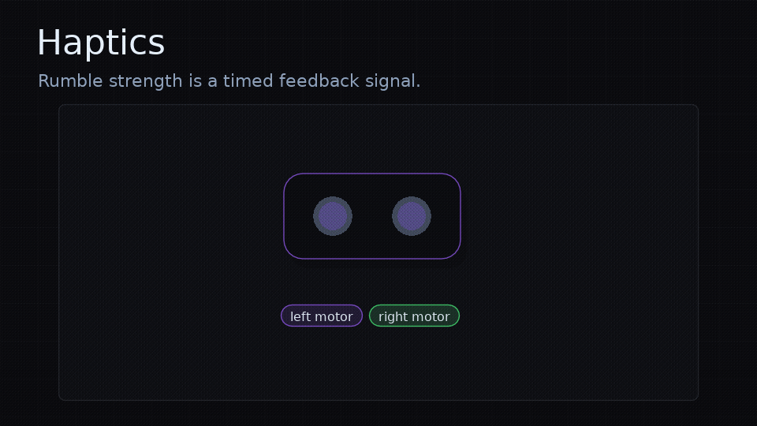                        |
| Particles       | 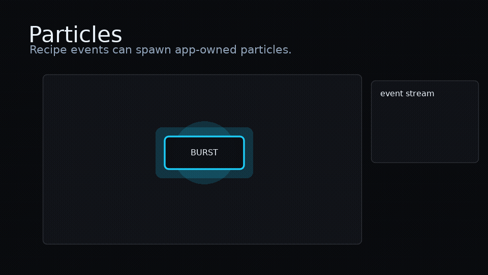                               |
| Shader          | 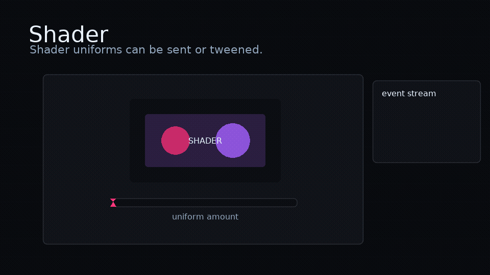                                         |
| Post Processing |                |
| Feedbacks       |      |
| LOVE2D          | 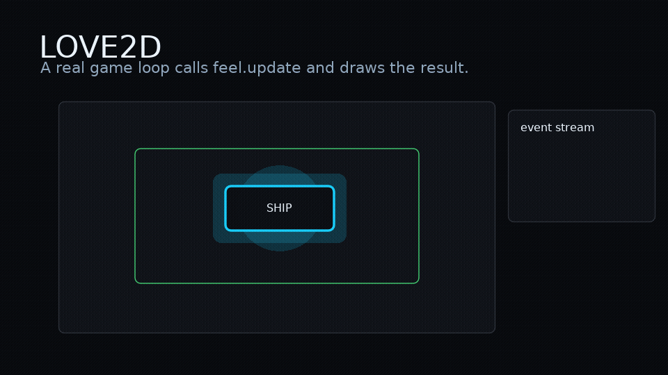                                   |
| g3d             | 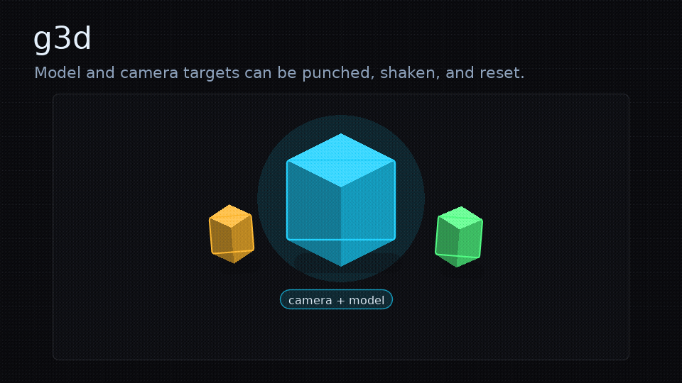                 |
| Menori          | 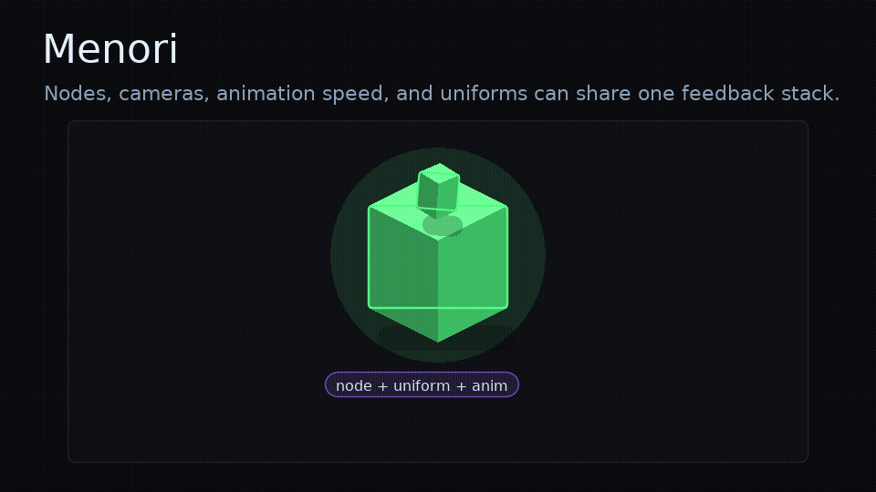     |

<!-- /feel:feature-gif-gallery -->
