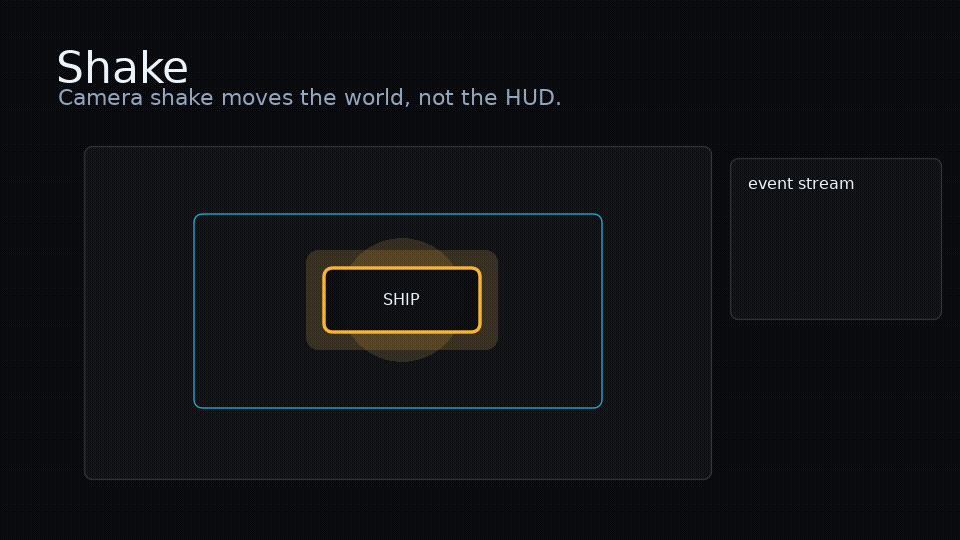

# LOVE Adapter

<!-- feel:feature-gif shake -->

<!-- /feel:feature-gif shake -->

`feel.love` is an opt-in adapter for LOVE-specific side effects. It keeps the core runner small while giving LOVE apps convenient handlers for sound, haptics, particles, shaders, post-processing, camera, and screen feedback.

```lua
local feel = require("feel")
local feelLove = require("feel.love")
local fx = feelLove.new()
```

For 3D model and camera transforms, use the separate [g3d Helpers](g3d.md) or [Menori Helpers](menori.md) modules.

## Handlers

Pass `fx:handlers(extra)` to `feel.play`. The adapter handles registered audio cues and known adapter events first, then calls your `extra.audio` or `extra.emit` callback.

```lua
feel.play("hit", target, fx:handlers({
  emit = function(event, ctx) end,
  audio = function(event, ctx) end,
}))
```

Unknown cues and events are no-ops for the adapter, so user callbacks can still own project-specific effects.

## Event Summary

| Area | Events |
| --- | --- |
| Sound | `sound.play`, `sound.stop`, `sound.pause`, `sound.resume`, `sound.volume`, `sound.pitch`, `sound.pan` |
| Haptics | `haptic.play`, `haptic.stop`, `haptic.vibrate` |
| Particles | `particle.emit`, `particle.start`, `particle.stop`, `particle.reset`, `particle.move` |
| Shaders | `shader.send`, `shader.tween`, `shader.apply`, `shader.clear` |
| Post | `post.set`, `post.tween`, `post.enable`, `post.disable`, `post.weight`, `post.clear` |
| Camera | `camera.shake`, `camera.zoom`, `camera.move`, `camera.reset` |
| Screen | `screen.flash`, `screen.fade`, `screen.clear` |

## Sound

Register one cue with `fx:sound(name, sourceOrSources, opts)` or several with `fx:sounds(map)`.

```lua
fx:sounds({
  hit = love.audio.newSource("hit.wav", "static"),
  ui = {
    love.audio.newSource("ui-a.wav", "static"),
    love.audio.newSource("ui-b.wav", "static"),
  },
})
```

A cue may be one LOVE `Source` or an array of alternate sources. Playback chooses one alternate at random. By default playback calls `stop()` before `play()`; pass `{ restart = false }` to keep already-playing sources running.

Audio steps play registered cues through `fx:handlers()`.

```lua
{ kind = "audio", cue = "hit" }
```

Sound control events use `emit`:

```lua
{ kind = "emit", event = "sound.volume", payload = { cue = "hit", volume = 0.5, duration = 0.2 } }
{ kind = "emit", event = "sound.pitch", payload = { cue = "hit", pitch = 0.8, duration = 0.15 } }
{ kind = "emit", event = "sound.pan", payload = { cue = "hit", pan = -1, duration = 0.1 } }
```

Supported sound events are `sound.play`, `sound.stop`, `sound.pause`, `sound.resume`, `sound.volume`, `sound.pitch`, and `sound.pan`. Use `fx:stopSound(name)` or `fx:stopSounds()` for direct stop control.

Sound control tweens stack by default. Add `restart = true` to replace the previous tween for the same cue/property.

## Sound Effect Recipes

Fade a looping ambience cue in, then fade it out later:

```lua
fx:sound("ambience", love.audio.newSource("ambience.ogg", "stream"), { restart = false, volume = 0 })

feel.define("ambience.in", {
  { kind = "emit", event = "sound.play", payload = { cue = "ambience" } },
  { kind = "emit", event = "sound.volume", payload = { cue = "ambience", volume = 0.65, duration = 1.2, ease = "quadout" } },
})

feel.define("ambience.out", {
  { kind = "emit", event = "sound.volume", payload = { cue = "ambience", volume = 0, duration = 0.8, ease = "quadin" } },
  { kind = "wait", duration = 0.8 },
  { kind = "emit", event = "sound.stop", payload = { cue = "ambience" } },
})
```

Duck a music bed under an impact, then restore it:

```lua
feel.define("impact.with.duck", {
  { kind = "emit", event = "sound.volume", payload = { cue = "music", volume = 0.35, duration = 0.08 } },
  { kind = "audio", cue = "impact" },
  { kind = "wait", duration = 0.18 },
  { kind = "emit", event = "sound.volume", payload = { cue = "music", volume = 1, duration = 0.45, ease = "quadout" } },
})
```

Bend pitch for slow-motion or power-up feedback:

```lua
feel.define("slowmo.hit", {
  { kind = "emit", event = "sound.pitch", payload = { cue = "hit", pitch = 0.72, duration = 0.12 } },
  { kind = "audio", cue = "hit" },
  { kind = "emit", event = "sound.pitch", payload = { cue = "hit", pitch = 1, duration = 0.3, ease = "backout" } },
})
```

Sweep a cue across stereo space:

```lua
feel.define("ui.sweep", {
  { kind = "emit", event = "sound.pan", payload = { cue = "ui", pan = -1 } },
  { kind = "audio", cue = "ui" },
  { kind = "emit", event = "sound.pan", payload = { cue = "ui", pan = 1, duration = 0.25, ease = "quadout" } },
  { kind = "wait", duration = 0.25 },
  { kind = "emit", event = "sound.pan", payload = { cue = "ui", pan = 0, duration = 0.15 } },
})
```

## Haptics

Register app-owned joysticks with `fx:haptic(name, joystickOrJoysticks, opts)` or `fx:haptics(map)`.

```lua
local pads = love.joystick.getJoysticks()
fx:haptic("p1", pads[1])
fx:haptic("p2", pads[2])
```

Use `haptic.play` for cross-platform feedback. By default it rumbles registered joystick targets and also calls `love.system.vibrate(duration)` when LOVE exposes system vibration.

```lua
feel.define("impact.rumble", {
  { kind = "emit", event = "haptic.play", payload = { value = 0.6, duration = 0.18 } },
})
```

`value` drives both motors. `left` and `right` override that value independently for controllers that support separate motors.

```lua
feel.define("impact.sweep", {
  { kind = "emit", event = "haptic.play", payload = { left = 0.2, right = 0.9, duration = 0.22 } },
})
```

For multiplayer games, include `name` to target one registered joystick. Pass `system = false` when a controller-only pulse should not also vibrate the mobile/system device.

```lua
feel.define("p1.damage", {
  { kind = "emit", event = "haptic.play", payload = { name = "p1", value = 0.8, duration = 0.16, system = false } },
})
```

Supported haptic events are `haptic.play`, `haptic.stop`, and `haptic.vibrate`. Use `fx:stopHaptic(name)` or `fx:stopHaptics()` for direct stop control.

```lua
feel.define("rumble.stop", {
  { kind = "emit", event = "haptic.stop", payload = {} },
})

feel.define("mobile.vibrate", {
  { kind = "emit", event = "haptic.vibrate", payload = { duration = 0.2 } },
})
```

## Particles

Register app-created LOVE `ParticleSystem`s with `fx:particle(name, system, opts)` or `fx:particles(map)`.

```lua
local image = love.graphics.newImage("spark.png")
local sparks = love.graphics.newParticleSystem(image, 256)
sparks:setParticleLifetime(0.25, 0.7)
sparks:setSpeed(80, 280)
sparks:setSpread(math.pi * 2)
sparks:setColors(0.1, 0.8, 1, 1, 0.1, 0.8, 1, 0)

fx:particle("sparks", sparks)
```

Particle configuration stays on the LOVE `ParticleSystem`. The adapter only stores systems, updates them, draws them, and translates recipe events into system calls.

```lua
feel.define("hit.sparks", {
  { kind = "emit", event = "particle.emit", payload = { name = "sparks", count = 24, x = 120, y = 80 } },
})
```

Supported particle events are `particle.emit`, `particle.start`, `particle.stop`, `particle.reset`, and `particle.move`.

```lua
feel.define("fire.start", {
  { kind = "emit", event = "particle.start", payload = { name = "fire", x = 420, y = 300 } },
})

feel.define("fire.move", {
  { kind = "emit", event = "particle.move", payload = { name = "fire", x = 520, y = 320 } },
})

feel.define("fire.stop", {
  { kind = "emit", event = "particle.stop", payload = { name = "fire" } },
})
```

Call `fx:drawParticles()` where the systems should render. If particles should move with the camera adapter, draw them between `fx:push()` and `fx:pop()`.

## Shaders

Register app-created LOVE `Shader`s with `fx:shader(name, shader, opts)` or `fx:shaders(map)`.

```lua
local shader = love.graphics.newShader([[
extern number amount;

vec4 effect(vec4 color, Image tex, vec2 uv, vec2 screen)
{
  vec4 pixel = Texel(tex, uv) * color;
  pixel.r = min(1.0, pixel.r + amount);
  return pixel;
}
]])

fx:shader("glow", shader, { uniforms = { amount = 0 } })
```

Shader code and uniform names stay app-owned. The adapter stores the shader, sends uniforms, and can tween numeric scalar uniforms through `feel.update(dt)`.

```lua
feel.define("glow.pulse", {
  { kind = "emit", event = "shader.apply", payload = { name = "glow" } },
  { kind = "emit", event = "shader.send", payload = { name = "glow", uniform = "amount", value = 0.2 } },
  { kind = "emit", event = "shader.tween", payload = { name = "glow", uniform = "amount", value = 0.8, duration = 0.15 } },
  { kind = "wait", duration = 0.2 },
  { kind = "emit", event = "shader.tween", payload = { name = "glow", uniform = "amount", value = 0, duration = 0.3 } },
})
```

Supported shader events are `shader.send`, `shader.tween`, `shader.apply`, and `shader.clear`.

```lua
feel.define("glow.clear", {
  { kind = "emit", event = "shader.clear", payload = {} },
})
```

For scoped drawing, wrap only the draw calls that should use the shader:

```lua
fx:pushShader("glow")
drawActor()
fx:popShader()
```

## Post Processing

Post-processing captures a draw callback into an adapter-owned canvas, applies built-in screen-space effects, and draws the final result.

```lua
function love.draw()
  fx:drawPost(function()
    drawWorld()
  end)
  drawHud()
  fx:drawOverlay()
end
```

Use `post.set` for immediate values, `post.tween` for timed parameter changes, and `post.weight` to blend between the original and processed scene.

```lua
feel.define("impact.bloom", {
  { kind = "emit", event = "post.set", payload = { effect = "bloom", values = { threshold = 0.55 } } },
  { kind = "emit", event = "post.tween", payload = { effect = "bloom", values = { intensity = 1 }, duration = 0.12, restart = true } },
  { kind = "wait", duration = 0.16 },
  { kind = "emit", event = "post.tween", payload = { effect = "bloom", values = { intensity = 0 }, duration = 0.35, restart = true } },
})
```

Supported post events are `post.set`, `post.tween`, `post.enable`, `post.disable`, `post.weight`, and `post.clear`. Built-in effects are `bloom`, `chromatic`, `grade`, `lens`, and `vignette`; see [Post Processing](post-processing.md) for parameters and recipes.

`post.tween` and `post.weight` stack by default. Add `restart = true` when the new tween should replace the previous tween for the same effect parameter.

Only drawing inside `fx:drawPost(...)` is processed. Draw HUD or adapter overlays afterward when they should stay readable.

## Camera And Screen

Camera events mutate adapter-owned draw state. Wrap world drawing with `fx:push()` and `fx:pop()`.

```lua
function love.draw()
  fx:push()
  drawWorld()
  fx:pop()
  fx:drawOverlay()
end
```

Supported camera events are `camera.shake`, `camera.zoom`, `camera.move`, and `camera.reset`.

Screen events draw overlays through `fx:drawOverlay()`. Supported screen events are `screen.flash`, `screen.fade`, and `screen.clear`.

Call both `feel.update(dt)` and `fx:update(dt)` from `love.update(dt)`. Adapter update advances camera/screen state and registered particle systems.
