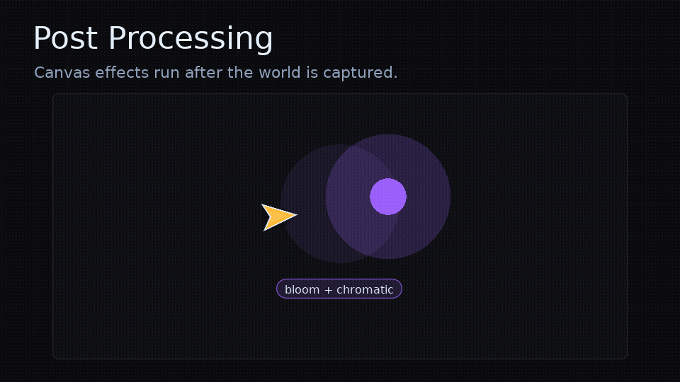

# Post Processing

<!-- feel:feature-gif post-processing -->

<!-- /feel:feature-gif post-processing -->

`feel.love` includes a canvas-backed 2D post-processing pipeline. Wrap the scene you want processed with `fx:drawPost(drawScene)`.

```lua
function love.draw()
  fx:drawPost(function()
    drawWorld()
    drawActors()
  end)
  drawHud()
  fx:drawOverlay()
end
```

Only drawing inside `fx:drawPost(...)` is captured and processed. Draw HUD, menus, debug overlays, or `fx:drawOverlay()` afterward when they should stay crisp and unaffected by bloom, chromatic aberration, lens distortion, or grading.

The pipeline is a LOVE adapter feature, so recipes use normal `emit` steps.

## Events

```lua
{ kind = "emit", event = "post.set", payload = { effect = "bloom", values = { intensity = 0.8 } } }
{ kind = "emit", event = "post.tween", payload = { effect = "chromatic", values = { force = 1, x = 0.012, y = -0.006 }, duration = 0.12 } }
{ kind = "emit", event = "post.weight", payload = { value = 0.5, duration = 0.2 } }
{ kind = "emit", event = "post.clear" }
```

- `post.set` applies values immediately and enables the effect.
- `post.tween` animates numeric values through `feel.update(dt)` and enables the effect.
- `post.enable` and `post.disable` toggle one effect.
- `post.weight` blends between the original scene and the processed scene.
- `post.clear` resets every effect to neutral values.

## Effects

| Effect | Parameters | Notes |
| --- | --- | --- |
| `bloom` | `intensity`, `threshold`, `softness`, `passes` | `passes` controls repeated blur rounds for a wider haze. |
| `chromatic` | `force`, `x`, `y` | `x` and `y` are normalized screen-space offsets. |
| `grade` | `exposure`, `saturation`, `hueShift`, `contrast` | Color and contrast shaping. |
| `lens` | `distortion` | Radial lens warp. |
| `vignette` | `intensity`, `radius`, `softness` | Darkens edges. |
| `volume` | `weight` | Controlled through `post.weight`. |

Processing order is fixed: color grade, lens distortion, chromatic aberration, bloom, vignette, then global weight blend.

Chromatic `x` and `y` are normalized screen-space offsets. Small values like `0.006` to `0.015` are usually enough for a visible channel split.

## Recipes

Bloom impact:

```lua
feel.define("impact.bloom", {
  { kind = "emit", event = "post.set", payload = { effect = "bloom", values = { threshold = 0.45, softness = 0.28, passes = 3 } } },
  { kind = "emit", event = "post.tween", payload = { effect = "bloom", values = { intensity = 1.1 }, duration = 0.1, ease = "quadout", restart = true } },
  { kind = "wait", duration = 0.16 },
  { kind = "emit", event = "post.tween", payload = { effect = "bloom", values = { intensity = 0.25 }, duration = 0.35, ease = "quadout", restart = true } },
})
```

For a hazy bloom, lower `threshold`, raise `softness`, increase `passes`, and draw a bright source inside `fx:drawPost(...)`. Thin line art often needs a filled glow source behind it before bloom reads as a halo.

Chromatic hit:

```lua
feel.define("impact.chromatic", {
  { kind = "emit", event = "post.tween", payload = { effect = "chromatic", values = { force = 1, x = 0.012, y = -0.006 }, duration = 0.06 } },
  { kind = "wait", duration = 0.08 },
  { kind = "emit", event = "post.tween", payload = { effect = "chromatic", values = { force = 0, x = 0, y = 0 }, duration = 0.22 } },
})
```

Global post volume blend:

```lua
feel.define("post.duck", {
  { kind = "emit", event = "post.weight", payload = { value = 0.25, duration = 0.2 } },
  { kind = "wait", duration = 0.2 },
  { kind = "emit", event = "post.weight", payload = { value = 1, duration = 0.35 } },
})
```

## Notes

`fx:drawPost(drawScene)` falls back to calling `drawScene()` directly when LOVE canvas or shader APIs are unavailable. Depth of field and moving filters are intentionally deferred until the adapter has an app-provided depth, focus, or mask story.
