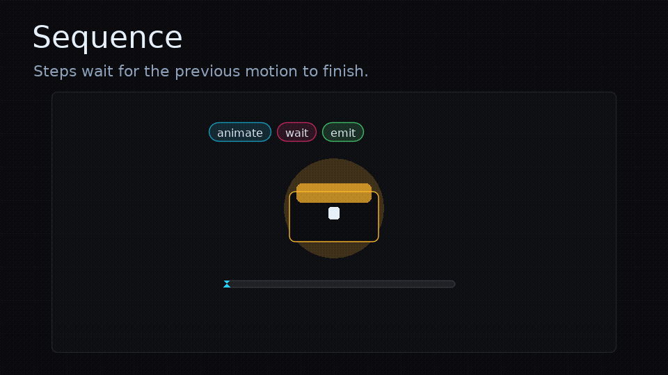

# Sequence Steps

<!-- feel:feature-gif sequence -->

<!-- /feel:feature-gif sequence -->

Each step is a table with a `kind`. Steps run in order unless a control-flow step changes how child steps are played.

## Step Reference

| Kind | Main fields | Purpose |
| --- | --- | --- |
| `animate` | `to`, `from`, `duration`, `ease`, `delay` | Tween numeric fields on `target.values`. |
| `spring` | `to`, `pull`, `from`, `stiffness`, `damping`, `settle` | Drive fields with spring physics (overshoot and settle). |
| `wait`, `pause` | `duration` or `time` | Delay the next step. |
| `emit` | `event`, `name`, `payload` | Send a host-owned event to `opts.emit`. |
| `audio` | `cue`, `audioKind` | Send an audio cue to `opts.audio`. |
| `callback` | `callback` or `fn` | Run Lua code and continue. |
| `log` | `message` or `text` | Log through `opts.log` or `print`. |
| `play` | `name`, `sequence`, `steps`, `step`, `feedback` | Run one child sequence before continuing. |
| `parallel` | `steps` or `sequences` | Run child sequences together, then continue. |
| `repeat` | `count`, `times`, `forever`, plus child sequence fields | Run a child sequence repeatedly. |
| `random` | `options` | Pick one weighted child option. |

## Animation And Timing

`animate` tweens numeric fields on `target.values`, including custom fields:

```lua
{ kind = "animate", duration = 0.12, to = { x = 12, scale = 1.08, teleportGlow = 1 }, ease = "quadout" }
```

Use `from` to set starting values before a tween, `delay` to delay a tween, and `onStart`, `onUpdate`, or `onComplete` hooks for step-local callbacks.

Supported string eases are `linear`, plus `in`, `out`, and `inout` variants for `quad`, `cubic`, `quart`, `quint`, `expo`, `sine`, `circ`, `back`, `elastic`, and `bounce`. For example: `quadout`, `backout`, `bounceout`, or `bounceinout`.

Custom easing functions can be registered on the exposed Flux easing table. An easing receives progress `p` from `0` to `1` and should return the adjusted progress.

```lua
local feel = require("feel")

feel.flux.easing.pop = function(p)
  return math.sin(p * math.pi * 0.5) ^ 0.7
end

feel.define("button.pop", {
  { kind = "animate", duration = 0.18, to = { scale = 1.24 }, ease = "pop" },
  { kind = "animate", duration = 0.16, to = { scale = 1 }, ease = "backout" },
})
```

Keep custom easing functions deterministic and numeric. Flux will raise an error if a sequence references an easing name that is not registered.

### Springs

`spring` drives `target.values` with a damped harmonic oscillator instead of a fixed-duration tween. There is no duration or easing curve to pick: the motion overshoots and settles from physics, which is what makes impacts and snappy UI feel alive. A spring exposes two motions:

- `to` moves the **rest anchor**; the value springs toward it. Use it for transitions.
- `pull` is an **instantaneous impulse**; the value is displaced and springs back to its anchor. Use it for impact punches. The punch is applied immediately, before the next update.

```lua
-- snappy press: punch the scale down, let it spring back to 1
{ kind = "spring", pull = { scale = -0.2 }, stiffness = 220, damping = 12 }

-- spring a panel into place
{ kind = "spring", to = { x = 0 }, from = { x = -40 }, stiffness = 180, damping = 16 }
```

Tuning fields (all optional):

- `stiffness` (alias `k`, default `150`) — how hard it pulls toward the anchor.
- `damping` (alias `d`, default `10`) — how quickly it loses energy. Lower is bouncier; near `2 * sqrt(stiffness)` is critically damped (no overshoot).
- `settle` (alias `epsilon`, default `0.01`) — the step completes once every field is within this distance and velocity of its anchor, then snaps exactly to it.
- `duration` — optional hard cap in seconds that force-settles the spring even if it has not reached `settle`.

`from`, `onStart`, `onUpdate`, and `onComplete` work the same as `animate`. Springs pause, resume, and clear with their run like any other step.

For spring motion outside a sequence, `feel.spring(x, stiffness, damping)` returns a raw spring you drive yourself with `spring:update(dt)`, `spring:pull(force)`, `spring:animate(target)`, and `spring:settled()`.

`wait` and `pause` delay the next step until enough `feel.update(dt)` time has passed.

```lua
{ kind = "wait", duration = 0.12 }
```

## Side Effects

`emit` hands a host-owned event to `opts.emit(event, ctx)`.

```lua
{ kind = "emit", event = "burst", payload = { count = 18 } }
```

`audio` hands an audio cue to `opts.audio(event, ctx)`.

```lua
{ kind = "audio", cue = "ui-pop" }
```

`callback` runs arbitrary Lua and then continues.

```lua
{ kind = "callback", callback = function(ctx) combo = combo + 1 end }
```

`log` calls `opts.log(message, ctx)` when provided, otherwise it prints.

## Composition

`play` runs a named or inline child sequence before continuing.

```lua
{ kind = "play", name = "screen.flash" }
```

`parallel` runs child steps or sequences at the same time and continues when all branches finish.

```lua
{
  kind = "parallel",
  steps = {
    { kind = "animate", duration = 0.08, to = { scale = 1.12 } },
    { kind = "emit", event = "camera.shake", payload = { amount = 8 } },
  },
}
```

`repeat` runs a child step or sequence multiple times. `forever = true` loops until `feel.clear()` cancels it.

`random` chooses exactly one weighted child option.

```lua
{
  kind = "random",
  options = {
    { weight = 3, step = { kind = "emit", event = "spark.small" } },
    { weight = 1, step = { kind = "emit", event = "spark.big" } },
  },
}
```

Use [LOVE Adapter](love-adapter.md) events when emitted events should control registered LOVE sounds, particles, shaders, camera, screen overlays, or post-processing.
